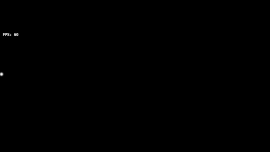
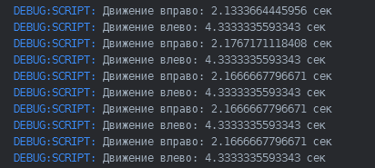
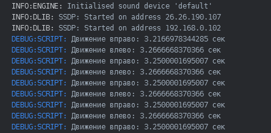
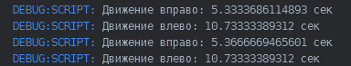
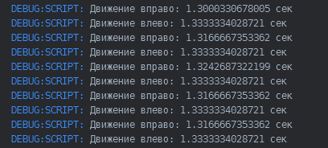

# Что такое delta-time (dt) и зачем он нужен?

Молодец, что продолжаешь изучать игровую разработку в Defold!

Дорогу осилит идуший, как и этот урок :)

---

Если вы не знаете, что такое fps и Герц, откройте файл в папке doc: ["fps.md"](defold://open?path=/doc/fps.md) 

Перемещение игрового объекта без dt при 60 и 30 fps:

Перемещение игрового c dt при 60 и 30 fps:

Что такое FPS:

# Что такое dt (delta time) в играх?

dt (delta time) — это разница во времени между текущим кадром и предыдущим кадром, выраженная в секундах. Это фундаментальный концепт в разработке игр, который помогает сделать игровую логику независимой от частоты кадров (FPS).

# Почему dt нужен?

Представь, что твой персонаж должен двигаться на 5 пикселей за каждый кадр. Это звучит просто, но есть проблема: разные компьютеры рендерят разное количество кадров в секунду.

~~~ Lua
function update(self, dt)
    local speed = 5  -- пиксели в секунду
    self.x = self.x + speed 
end

~~~
При 30 FPS → объект будет двигаться на 5×30 = 150 пиксель в секунду

При 60 FPS → объект будет двигаться на 5×60 = 300 пиксель в секунду

Получается, игра работает с разной скоростью при разной частоте кадров!

Вместо того чтобы добавлять фиксированное значение за каждый кадр, ты умножаешь скорость на прошедшее время. Так движение остаётся гладким и предсказуемым при любом FPS.

~~~ Lua
function update(self, dt)
    local speed = 5  -- пиксели в секунду
    self.x = self.x + speed * dt
end
~~~

### Ещё раз, dt зависит только от частоты кадров (FPS), которые рендерит компьютер

Мощность компьютера влияет на FPS:

Слабый ПК: может рендерить только <kbd>30 FPS (dt ≈ 0.033 сек)<kbd>

Быстрый ПК: может рендерить <kbd>60 FPS (dt ≈ 0.016 сек)<kbd>

Без dt:

~~~ Lua
(30 FPS):
За 1 кадр: расстояние = 5 единиц
За 1 секунду: 5 * 30 кадров = 150 единиц

(60 FPS):
За 1 кадр: расстояние = 5 единиц
За 1 секунду: 5 * 60 кадров = 300 единиц
~~~

Но благодаря dt, скорость объектов остаётся одинаковой:

~~~
(30 FPS):
dt = 0.033
- За 1 кадр: расстояние = 100 * 0.033 = 3.3 единицы
- За 1 секунду: 3.3 * 30 кадров = 100 единиц ✓

(60 FPS):
dt = 1.6
- За 1 кадр: расстояние = 100 * 0.016 = 1.6 единицы
- За 1 секунду: 1.6 * 60 кадров = 100 единиц ✓
~~~

Таким образом, объекты двигаются одинаково на любом FPS (благодаря изменяющемуся dt)

Давайте проверим это на практике, изменив fps в игре:

В папке scripts откройте скрипт ["comparison.script"](defold://open?path=/scripts/comparison.script) 

В этом скрипте находятся две функции update, но одна из низ закомментирована.
Запустите код с разной реализацей перемещения игрового объекта в update.

<kbd>Без dt</kbd>:

<kbd>С dt</kbd>:

Внимательный программист заметит, что в update я использую разное значение для speed.

Это объясняется тем, что <kbd>dt — это доля секунды, а не полная секунда.</kbd>

Попробуйте изменить значения скорости и вы получите такой же результат!

<kbd> dt — позволяет создавать движение, независимое от частоты кадров на устройстве</kbd>.

Без <kbd>dt</kbd> и speed = 2:

С <kbd>dt</kbd> и speed = 500:

При <kbd>sys.set_update_frequency(30)</kbd>:

Функция <kbd>update(self, dt)</kbd> будет вызываться 30 раз в секунду

<kbd>dt</kbd> будет примерно 0.033 секунды (1/30)

Игра работает медленнее, но потребляет меньше ресурсов (батарея, процессор, видеокарта)

При <kbd>sys.set_update_frequency(60)</kbd>:

Функция <kbd>update(self, dt)</kbd> будет вызываться 60 раз в секунду

<kbd>dt</kbd> будет примерно 0.0167 секунды (1/60)

Игра выглядит плавнее, но потребляет больше ресурсов

### Вы обратили внимание на мерцание с dt при 30 кадров в секунду?

Мерцание при 30 FPS происходит потому, что объект движется очень быстро относительно частоты обновления экрана.

Почему происходит мерцание:
При 30 FPS и speed = 500:

<kbd>dt ≈ 0.033 сек</kbd>.

Движение за кадр: <kbd>500 * 0.033 = 16.5 пиксел/кадр</kbd>.

Объект "прыгает" на 16.5 пиксел за раз. При малой частоте кадров эти большие скачки видны как мерцание.

При 60 FPS:

<kbd>dt ≈ 0.0167 сек</kbd>.

Движение за кадр: <kbd>500 * 0.0167 = 8.35 пиксел/кадр</kbd>.

Скачки вдвое меньше, поэтому выглядит плавнее.
В общем, человеческий глаз замечает этот скачок.

В профессиональных играх эту проблему решают несколькими способами:

1. Фиксированная частота кадров (самый распространённый)

2. Адаптивная частота (для мобильных игр)

3. Интерполяция (предрендеринг кадров)

4. Vsync (синхронизация с монитором)

Оставлю эти вопросы для другого раза :)

## Остались вопросы?

## Задай их на defolder.com или под этой темой: https://defolder.com/t/defold-bez-boli/101?u=d_bl1n
