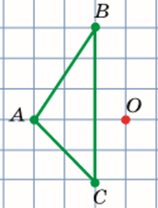
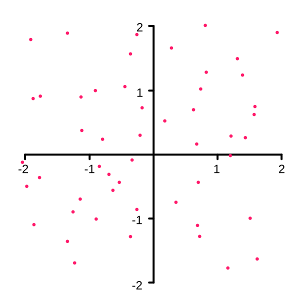
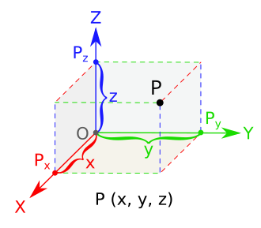
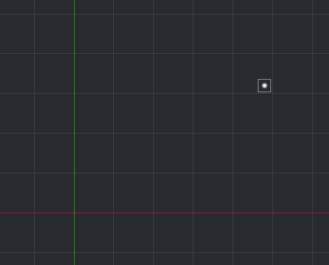
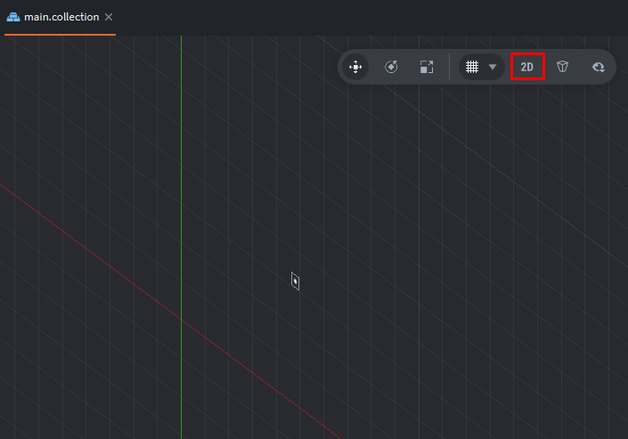
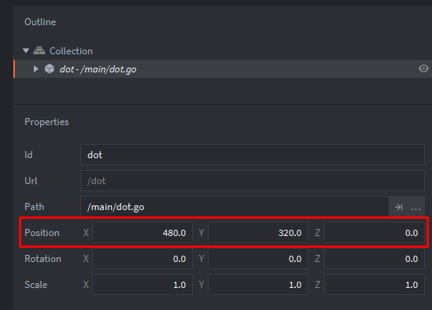
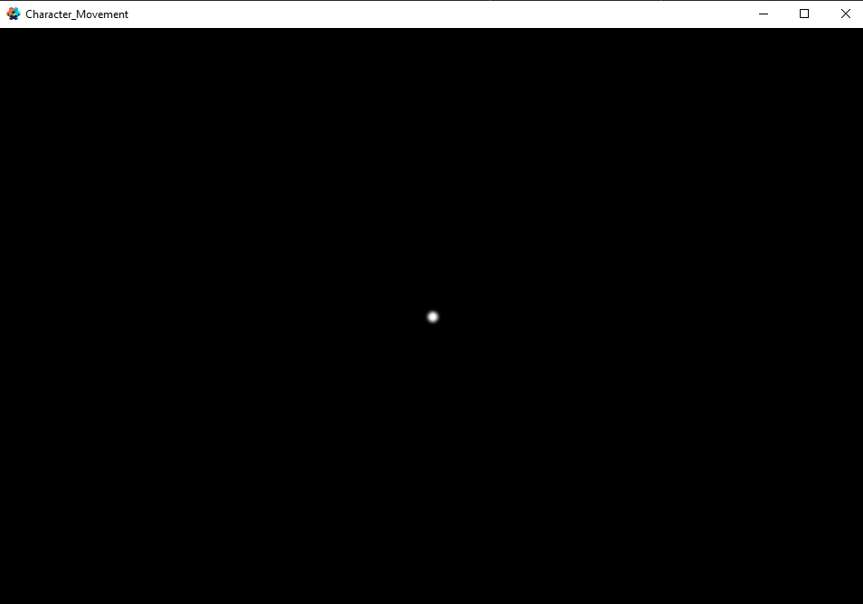
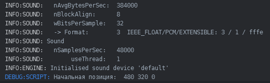
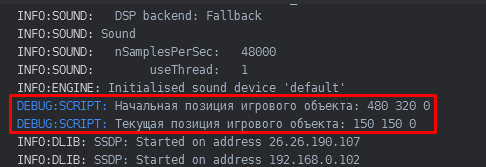

# Точка. Получение и изменение позиции игрового объекта. go.get_position(), go.set_position(). 

В этом уроке мы затроним некоторые фундаментальные знания по математике, научимся получать и изменять позицию игрового объекта в игровом движке Defold. 

Что вы видите на изображении ниже? Это не психологический тест :)

Точку? Надеюсь, что да ;)

<kbd>Точка</kbd> — это неделимый элемент математического пространства, указывающий на точное местоположение. Точка не имеет размерности (длины, ширины, высоты) и является основой для построения всех других геометрических фигур. 

Треугольник:


И ещё один вопрос: "В каком пространстве находится эта точка? В двухмерном или трехмерном?"

Точки в двухмерном пространстве могут быть расположены таким образом:

Двумерное пространство (2D) — это плоскость, подобная листу бумаги. Она характеризуется двумя измерениями и может быть описана двумя координатами (например, \(x\) и \(y\)).


Точка <kbd>P</kbd> трёхмерном пространстве может быть располоежна таким образом:

Трёхмерное пространство (3D) включает в себя длину, ширину и высоту, то есть три измерения. Оно содержит бесконечное количество двумерных пространств (плоскостей). 

Получается, для того, чтобы определить в каком пространстве находится точка (или любой игровой объект), достаточно указать систему коордиант, которая опишет его положение в пространстве.
Из этого следует, что без указания системы координат невозможно определить положение точки или фигуры. 

<kbd>Система координат</kbd> — это набор правил, задающий способ определения положения точки или тела с помощью чисел (координат).


Существует множество различных систем координат... 

Defold по сути является 3D движком. Defold использует трехмерную систему координат (XYZ), но при этом полностью поддерживает создание двумерных игр.
Если ты нажмешь на 2D в редакторе сцены, то заметишь это:


В последующих уроках мы будем практиковаться в двухмерной и трёхмерной системе координат. Но начнём мы с 2D, а затем перейдём в 3D.

Если ты перейдешь в ["main.collection"](defold://open?path=/main/main.collection) и посмотришь в свойства игрового объекта, то увидишь на каких координатах находится игровой объект <kbd>dot.go</kbd>. 


### Задание 1. "Получение позиции игрового объекта"
У нас есть игровой объект <kbd>dot.go</kbd>, находящейся в ["main.collection"](defold://open?path=/main/main.collection).
Если вы запустите проект <kbd>(ctrl + B)</kbd>, вы увидете его:

Необходимо получить коордианаты игрового объекта.
Для выполнения задачи можете использовать скрипт ["dot.script"](defold://open?path=/main/dot.script).

Примечание:
В Defold для получения текущей позиции игрового объекта используется функция: <kbd>go.get_position()</kbd>.

##### Решение:

В ["dot.script"](defold://open?path=/main/dot.script), в функцию <kbd>init()<kbd>, разместите такой код:
``` Lua
function init(self)
	-- Получаем идентификатор текущего игрового объекта
	local my_game_object_id = go.get_id()
	-- Создаём переменную и присваиваем ей значение типа vector3
	local pos = vmath.vector3(0, 0, 0)
	-- Получаем позицию игрового объетка (vector3)
	pos = go.get_position(my_game_object_id)
	-- Выводим значения в консоль
	print("Начальная позиция:", pos.x, pos.y, pos.z)
end
```

##### Вывод в косноли:


##### Комментарии к коду:
Присваивем локальной переменной <kbd>my_game_object</kbd> идентификатор игрового объекта с помощью функции <kbd>go.get_id()</kbd>:
``` Lua
	local my_game_object_id = go.get_id()
```

Создаём локальную переменную и присвоением ей значения типа <kbd>vector3()</kbd> (о векторах мы поговорим в следующем уроке). Эта переменная будет хранить позицию игрового объекта.
``` Lua
	local pos = go.get_position(my_game_object_id)
```

Присовоим переменной <kbd>pos</kbd> текущее значение позиции игрового объкта с помощью функции <kbd>go.get_position()</kbd>
``` Lua
	pos = go.get_position(my_game_object_id)
```

Выводим значение позиции игрового объета в консоль:
``` Lua
	print("Начальная позиция:", pos.x, pos.y, pos.z)
```

### Задание 2. "Изменение позиции игрового объекта"
У нас есть игровой объект point.go, находящейся в ["main.collection"](defold://open?path=/main/main.collection).
Установим позицию игровому объекту.
<kbd>x = 150, y = 150, z = 0</kbd>.

Примечание:
Измените положение игровому объекту с помощью функции: <kbd>go.set_position()</kbd>.

##### Решение:
В ["dot.script"](defold://open?path=/main/dot.script), в функцию <kbd>init()</kbd>, разместите такой код:
``` Lua
function init(self)
	-- Получаем идентификатор текущего игрового объекта
	local my_game_object_id = go.get_id()

	-- Получаем и выводим начальную позицию
	local pos = go.get_position(my_game_object_id)
	print("Начальная позиция:", pos.x, pos.y, pos.z)

	-- Устанавливаем новую позицию
	local new_pos = vmath.vector3(150, 150, 0)
	go.set_position(new_pos, my_game_object_id)

	-- Получаем и выводим обновлённую позицию
	pos = go.get_position(my_game_object_id)
	print("Обновлённая позиция:", pos.x, pos.y, pos.z)
end
```
##### Вывод в консоли:


##### Комментарии к коду:

Присваиваем переменной <kbd>new_pos</kbd> значение типа <kbd>vector3</kbd>
``` Lua
	local new_pos = vmath.vector3(150, 150, 0)
```
Устанавливаем игровому объекту новую позицию, хранящийся в переменной new_pos
``` Lua
	go.set_position(new_pos, my_game_object_id)
```

##### Может быть полезно:

go.get_position(), go.set_position(): https://defold.com/ref/stable/go-lua/
