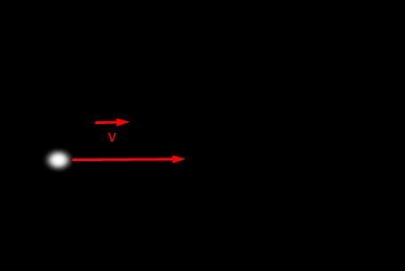
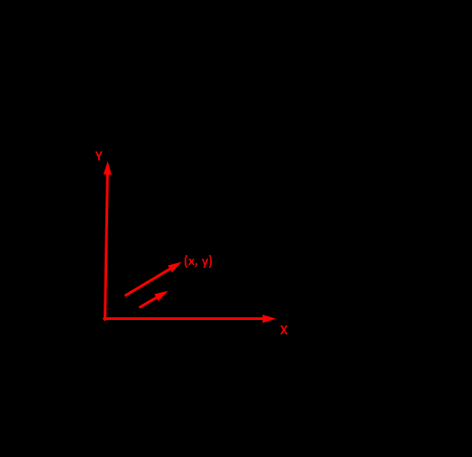
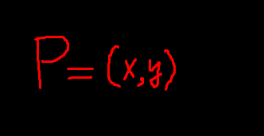
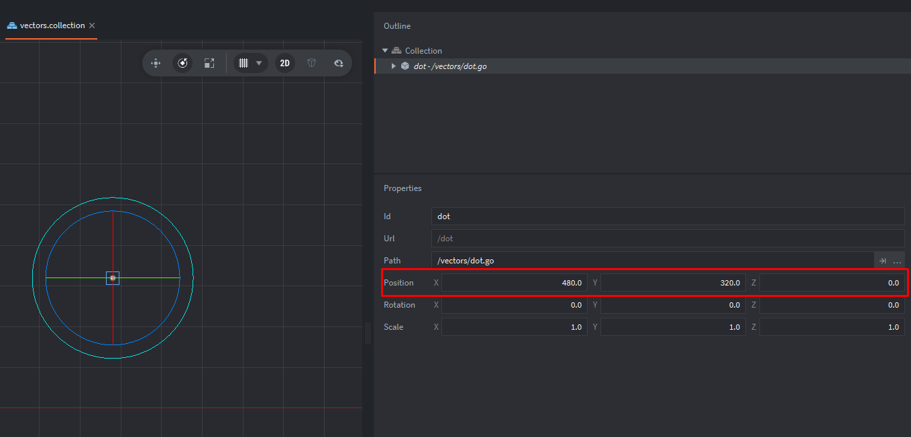
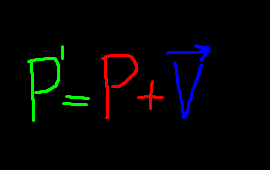
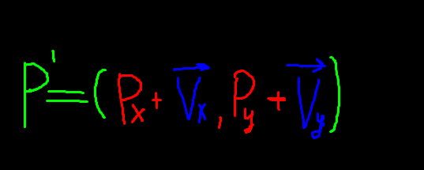
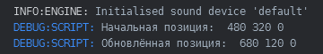
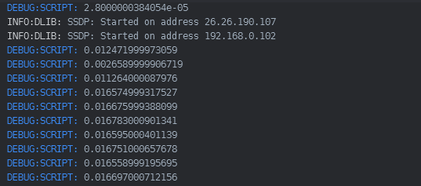
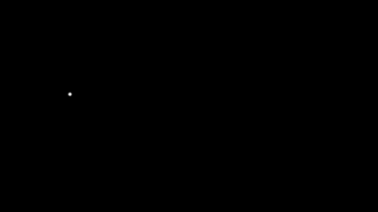

Прежде чем начать урок, рекомендую ознакомиться с этим постом: https://defolder.com/t/matematika-v-defold-chast-1-dejstviya-s-vektorami/42?u=d_bl1n

В нём достаточно хорошо описана тема Векторов.

#### Что такое вектор?

С какой скоростью должна бежать собака, чтобы не слышать звона сковородки, привязанной к ее хвосту?

В физическом мире любой движущийся объект обладает определённой скоростью и движется в конкретном направлении. Это определение вектора скорости, который является основной характеристикой движения в физике.

Возращаясь к точке, нужно отметить, что точка — это вектор с нулевой скоростью. 
Выходит так, что собака должна бежать с нулевой скоростью, чтобы не слышать звон сковородки.

В прошлом уроке мы присваивали нулевой вектор переменной:
<kbd> local pos = vmath.vector3(0, 0, 0) </kbd>

Мы также меняли позицию игрового объекта в трёхмерном пространстве с помощью векторного значения:

~~~ Lua
	-- Устанавливаем новую позицию
	local new_pos = vmath.vector3(150, 150, 0)
	go.set_position(new_pos, my_game_object_id)
~~~

Многие из нас знают, что скорость — это физическая величина, показывающая, какое расстояние тело проходит за единицу времени. Она характеризует быстроту перемещения и направление движения, поэтому является векторной величиной. Проще говоря, скорость показывает, насколько быстро движется объект. 
Получается, чтобы отобразить движение точки из прошлого урока, нам нужно взять в вооружение скорость и время.

<kbd>Вектор</kbd> — это направленный отрезок, которые имеет величину и направление.

В играх используют векторы для универсального и эффективного способа описать движение, которое имеет одновременно и направление, и величину (скорость).
Можно с уверенностью сказать, что все аспекты игр представлены математикой на том или ином уровне. Это не всегда очевидно для нас, как игроков, но за каждым действием, каждым движением персонажа и каждым графическим эффектом стоят сложные математические вычисления.

В Defold для представления векторов используется тип <kbd>vmath.vector3</kbd>, где поля .x, .y, .z — это компоненты. 

Этот вектор однозначно задаёт и направление, и длину (если его нормировать или использовать «как есть» для смещения).


Чем короче вектор, чем меньше его значение.
Чем длинее вектор, чем больше его значение.



Пусть игровой объект имеет начальную позицию (я не беру в расчёты z-координаты, т.к мы изучаем пока что движение в 2D):




Во время движения игрового объекта позиция будет меняться.



Тогда, наша формула для изменения положения игрового объекта для координатной плоскости (X,Y) будет выглядеть так:



Давайте применим эту формулу в Defold.

Напшием такой код в ["vector.scripts"](defold://open?path=/main/vector.scripts):
~~~ Lua
function init(self)
	-- Получаем идентификатор текущего игрового объекта
	local my_game_object_id = go.get_id()

	-- Получаем и выводим начальную позицию
	local pos = go.get_position(my_game_object_id)
	print("Начальная позиция:", pos.x, pos.y, pos.z)

	-- Создаём вектор
	local vec = vmath.vector3(200, -200, 0)
	
	-- Устанавливаем новую позицию
	local new_pos = pos + vec
	go.set_position(new_pos, my_game_object_id)

	-- Получаем и выводим обновлённую позицию
	pos = go.get_position(my_game_object_id)
	print("Обновлённая позиция:", pos.x, pos.y, pos.z)
end
~~~

Точка изменила положение в пространстве:


Векторы можно складывать/вычитать.

Консоль это подтверждает:



С изменением позиции игрового объекта всё должно быть понятно.
А как изменять позицию игровому объекту так, чтобы создать иллюзию движения?

Для тех кто не знал:
Изображение на экране компьютера постоянно обновляется, даже когда вы смотрите на статичную картинку. Этот процесс зависит от частоты обновления монитора, которая измеряется в герцах (Гц). Например, монитор с частотой 60 Гц обновляет изображение 60 раз в секунду, создавая иллюзию движения или статичности


Давайте провернём подобное, ведь возможности Defold позволяют это сделать.

Перед тем как начать, напишите такой код в ["vector.scripts"](defold://open?path=/main/vector.scripts):

~~~ Lua
function init(self) end -- можно удалить эту строку

function update(self, dt)
	print(dt)
end
~~~

Вывод в консоли:



#### Что такое dt?
Параметр <kbd>dt (delta time)</kbd> передаётся в функцию <kbd>update(self, dt)</kbd> и обозначает время (в секундах), прошедшее с момента предыдущего вызова <kbd>update</kbd>. Благодаря этому можно плавно анимировать объекты независимо от скорости кадров в секунду.

##### Как использовать dt
При расчёте изменения позиции, анимации, физики и других временно-зависимых процессов нужно умножать скорость или шаг на dt. Тогда при частоте кадров 60 FPS и dt ≈ 0.0167 объект, двигающийся со скоростью 100 ед/с, сместится за кадр на 100 × 0.0167 ≈ 1.67 единицы, а при 30 FPS (dt ≈ 0.0333) на ≈ 3.33 единицы — таким образом движение остаётся плавным и одинаковым по времени.

Давайте заставим нашу точку перемещаться по направлению вправо-влево:



Напишите такой код в ["vector.scripts"](defold://open?path=/main/vector.scripts):
``` Lua
function init(self)
	-- Устанавливаем начальную позицию
	go.set_position(vmath.vector3(60, 320, 0))
	self.pos = go.get_position()
	self.speed = 500
	self.dir = "right"  -- движение вправо-влево
end

function update(self, dt)
	-- Изменяем позицию в зависимости от направления
	if self.dir == "right" then
		self.pos.x = self.pos.x + self.speed * dt
		if self.pos.x >= 900 then
			self.dir = "left"
		end
	elseif self.dir == "left" then
		self.pos.x = self.pos.x - self.speed * dt
		if self.pos.x <= 60 then
			self.dir = "right"
		end
	end

	-- Применяем новую позицию
	go.set_position(self.pos)
end
```

Постоянная скорость игрового объекта в вычислениях:
~~~ Lua
self.speed = 500
~~~

Переменная <kbd>self.dir</kbd> является переменной флажком, в зависимости от значения которого точка двигаетсявправо или влево: 
~~~ Lua
self.dir = "right"  -- движение вправо-влево </kbd>
~~~

Изменяем значение компонента <kbd>.x</kbd> вектора <kbd>self.pos</kbd>, учитывая постоянную скорость <kbd>self.speed</kbd>. 

Иными словами, это форумал нахождения расстояния <kbd>S = V * t</kbd>, но у нас вот так: (S = S - V*t).
~~~ Lua
self.pos.x = self.pos.x - self.speed * dt
~~~

Условие, в котором сравнивается значение компонента <kbd>.x</kbd> вектора <kbd>self.pos</kbd> с значением <kbd>960</kbd>.

По сути, эти литералы(900,60) служат границей, за которую точке нельзя выходить.
~~~ Lua
if self.pos.x >= 960 then
~~~

Меняем значения флага на противоположное "влево":
~~~ Lua
elf.dir = "left"
~~~

Изменяем позицию игровому объекту:
~~~ Lua
-- Применяем новую позицию
go.set_position(self.pos)
~~~

В следующем кадре блок кода в <kbd>update</kbd> выполнится ещё раз, но уже с имзенными ранее значениями переменных.


##### Задача 1:
Попробуйте заставить двигаться точку "вверх-вниз".


##### Решение:
``` Lua
function init(self)
	-- Устанавливаем начальную позицию
	go.set_position(vmath.vector3(480, 50, 0))
	self.pos = go.get_position()
	self.speed = 500
	self.dir = "up"  -- движение вверх-вниз
end

function update(self, dt)
	-- Изменяем позицию в зависимости от направления
	if self.dir == "up" then
		self.pos.y = self.pos.y + self.speed * dt
		if self.pos.y >= 640 then
			self.dir = "down"
		end
	elseif self.dir == "down" then
		self.pos.y = self.pos.y - self.speed * dt
		if self.pos.y <= 0 then
			self.dir = "up"
		end
	end

	-- Применяем новую позицию
	go.set_position(self.pos)
end
```

В этих решения явного «вектора движения» нет — направление хранится в строке <kbd>self.dir</kbd> («up» или «down»).

И при каждом обновлении мы вручную меняем либо <kbd>self.pos.y</kbd> на <kbd>+self.speed * dt</kbd>, либо на <kbd> -self.speed * dt </kbd>.

##### Что за вектор движения?

Вектор движения в двумерных или трёхмерных играх — это переменная, обычно в виде объекта типа <kbd>vmath.vector3</kbd> (Defold), которая определяет направление движения объекта и может также хранить скорость по каждой оси.

~~~ Lua
self.dir = vmath.vector3(0, 1, 0)
~~~
Это вектор направления вверх, где:

<kbd>x = 0</kbd> — нет движения вправо/влево,

<kbd>y = 1</kbd> — движение вверх,

<kbd>z = 0</kbd> — обычно не используется для 2D.

При изменении положения объекта:
~~~ Lua
self.pos = self.pos + self.dir * self.speed * dt
~~~

<kbd>self.dir</kbd> указывает направление.

<kbd>self.speed</kbd> — скорость движения (единиц в секунду).

<kbd>dt</kbd> — время между кадрами.

Иными словами, вектор движения — это способ описать “куда двигаться” и “насколько быстро” в виде набора чисел, задающих движение по каждой оси координатного пространства. 
Тогда мы задавали направление строкой, но удобнее задавать вектор движения единичным вектором.

##### Задача 2:
Реализуйте решение из 1-ой задачи, используя вектор движения.

##### Решение:
~~~ Lua
function init(self)
	-- Устанавливаем начальную позицию
	go.set_position(vmath.vector3(60, 320, 0))
	self.pos = go.get_position()
	self.speed = 500
	self.dir = vmath.vector3(1, 0, 0)  -- движение вправо (по оси X)
end

function update(self, dt)
	-- Изменяем позицию в зависимости от направления
	self.pos.x = self.pos.x + self.dir.x * self.speed * dt
	
	if self.pos.x >= 960 then self.dir.x = - 1 
	elseif self.pos.x <= 0 then self.dir.x = 1 end  
	
	-- Применяем новую позицию
	go.set_position(self.pos)
end
~~~


##### Может быть полезно:

О векторах:
https://mathprofi.ru/vektory_dlya_chainikov.html

Жизненный цикл приложения Defold:
https://defold.com/manuals/application-lifecycle/

API Defold | update:
https://defold.com/ref/go/#update
