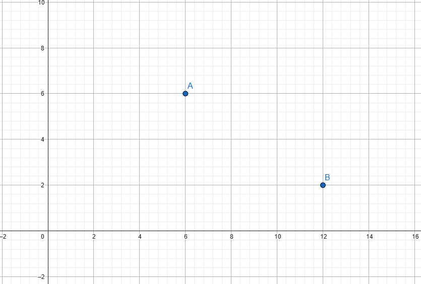
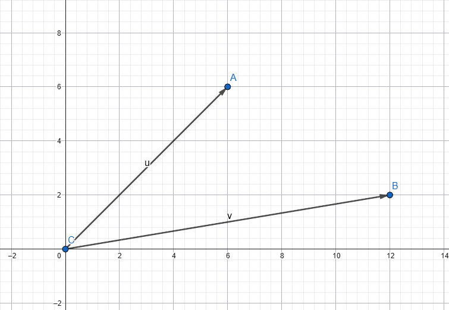
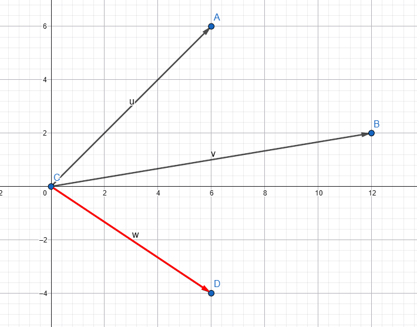
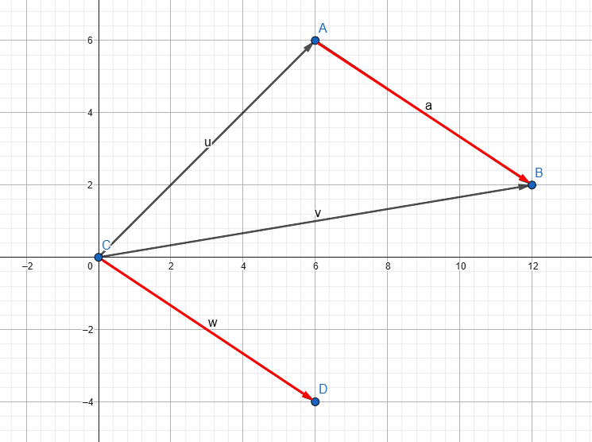
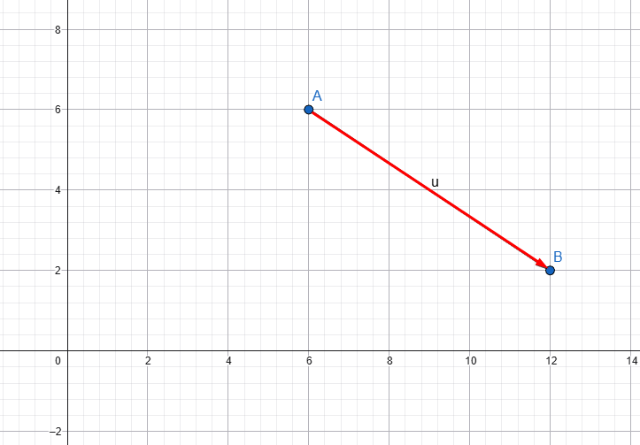
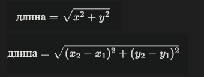
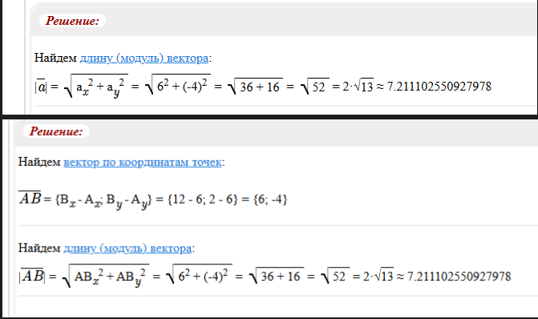
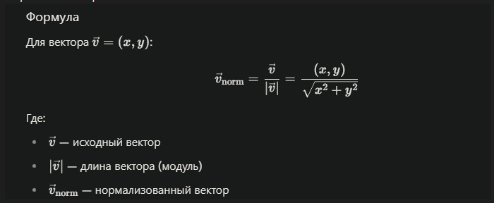
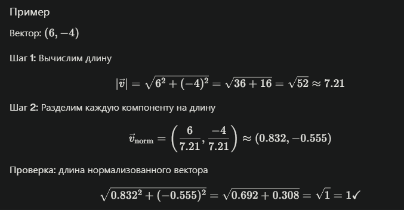

# Движение к цели. Вычисление расстояния через vmath.length(). Нормализация вектора.

В качестве повторения пройденных двух уроков, решите небольшую задачку.

Задача 1:

Напишите скрипт, изменяющий позицию игрового пространства на заданную позицию через клик левой клавиши мыши (куда кликнул, туда и установилась позиция игрового объекта).

Решение:
~~~ Lua
function init(self)
	msg.post(".", "acquire_input_focus")
	self.current_pos = go.get_position()
end

function update(self, dt)
	if self.target_pos ~= nil then
		self.current_pos = go.get_position()
		go.set_position(self.target_pos)
		self.target_pos = nil
	end
end

function on_input(self, action_id, action)
	if action_id == hash("touch") and action.pressed then
		self.target_pos = vmath.vector3(action.x, action.y, 0)
	end
end
~~~

А теперь представь, что ты игровой разработчик и тебе необходимо заставить игровой объект двигаться к определенной цели. 

Допустим, игровой объект, который должен двигаться расположен в точке А(6, 6). А игровой объект, к которому необходимо добраться, находится в точке B(12, 2). Как нам узнать расстояние, на которое мы должны сместиться из точки А в точку B?

Мы можем представить эти точки в виде вектора А(6, 6) и вектора B(12, 2).

Тогда, чтобы узнать, какой вектор нужен для того, чтобы добраться до точки B, необходимо вычесть разность векторов: 

Вектора АB = вектор B - вектор А.

(6, -4) = (12, 2) - (6, 6) = (12 - 6, 2 - 6)

Теперь перенесём полученный вектор из точки А, получим:

Если оставим только точку А и B и проведём между ними вектор, то получим:

Из разности двух векторов мы получили вектор смещения. 

На скриншоте выше вы можете увидеть направления из точки А в точку Б. В прошлом уроке вы узнали о том, что картинка на экране создаётся 60 кадров в секунду. 

Движение игровых объектов в играх — это небольшие изменения позиции игрового объекта за определённый промежуток времени. 

И достигается иллюзия движения тем, что в каждом кадре (1/60) мы рассчитываем движения по такой формуле:

<kbd> новая позиция = текущая позиция + нормализированный вектор направления * скорость * dt(время между двумя кадрами). </kbd>

Delta-Time (dt) — это время, прошедшее между двумя кадрами игры, измеренное в секундах. 

`dt` — это способ сделать движение одинаковым на всех компьютерах, независимо от FPS.

 В следующем уроке мы поговорим о dt более подробно.

Итак, нам нужно реализовать движение игрового объекта к указанной позиции на экране через клик ЛКМ.

Для этого нам понадобится рассчитать длину полученного вектора, и нормализировать вектор движения.

## Длина вектора

Длина вектора — это просто расстояние от начала до конца этого вектора, как линейка, измеряющая, насколько далеко он тянется в пространстве.

Длина вектора вычисляется по теореме Пифагора и может быть найдена с помощью координат и вектора:

Точка А имеет координаты (6, 6).

Точка B имеет координаты (12, 2).

Вектора AB = (6, -4).

В Defold длина вектора вычисляется вызовом всего одной функции vmath.length(vector):
~~~ Lua
	vmath.length(vector)
~~~

## Нормализация вектора

Для того, чтобы игровой объект мог двигаться в каком-то направлении, ему необходимо понять в каком направлении двигаться. Для этого нам необходимо нормализировать вектор.

**Нормализация вектора** — это преобразование вектора в **единичный вектор** (длина = 1) с сохранением направления.

В Defold для задачи существует функция vmath.normalize():

~~~ Lua
local vec = vmath.vector3(6, -4, 0)
local normalized_vec = vmath.normalize(vec)

print(normalized_vec)  -- vmath.vector3(0.832, -0.555, 0)
print(vmath.length(normalized_vec))  -- 1.0
~~~

На основе полученных знаний, попробуйте реализовать движение к цели по клику.

Решение:

~~~ Lua
function init(self)
	msg.post(".", "acquire_input_focus")
	self.speed = 200
	self.current_pos = go.get_position()
end

function update(self, dt)
	if self.target_pos ~= nil then
		self.current_pos = go.get_position() 
		local direction = self.target_pos - self.current_pos
		
		local distance = vmath.length(direction)
		
		if distance > 5 then -- если расстояние до цели больше 5
			local normalized_dir = vmath.normalize(direction)
			local movement = normalized_dir * self.speed * dt
			self.current_pos = self.current_pos + movement
			go.set_position(self.current_pos)
		else
			self.target_pos = nil  -- движение завершено
		end
	end
end

function on_input(self, action_id, action)
	if action_id == hash("touch") and action.pressed then
		self.target_pos = vmath.vector3(action.x, action.y, 0)
	end
end
~~~

## Домашняя работа

1. Какие вопросы решает вектор в математике/физике/информатике.
В результате каких противоречий возникло понятие векторов.

2. Длина вектора.
Длина вектора даёт нам:

- Информацию о расстоянии между двумя игровыми объектами.
- Возможность проверить, достигли ли цели
- Возможность рассчитать время
- Возможность реагировать на близость объектов

Попробуйте проверить это на практике в Defold.

3. Попробуйте убрать нормализацию вектора в вашем коде?
К чему это привело? Почему?

4. В каких областях игровой разработки используют нормализацию какого-либо значения?

Остались вопросы?
Задай их здесь: https://defolder.com/t/defold-bez-boli/101?u=d_bl1n
